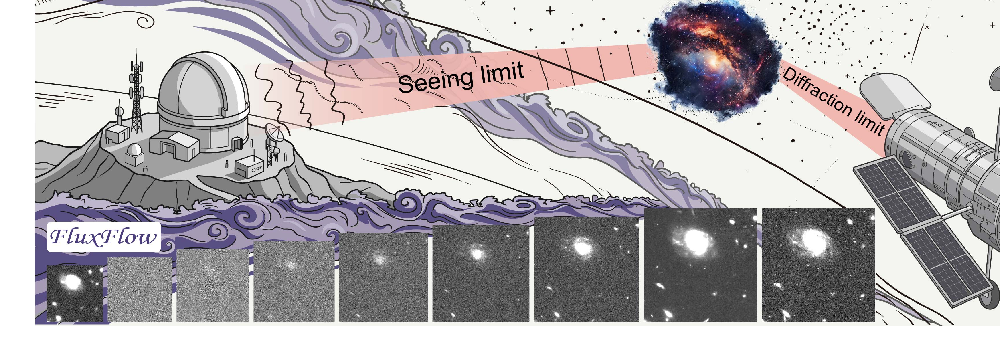

<div align="center">

<h1>FluxFlow: Conservative Flow-Matching for Astronomical Image Super-Resolution</h1>



<p>⭐ NeurIPS 2026 ⭐</p>

<p>
  <a href="https://shuhongll.github.io/">Shuhong Liu</a><sup>1,2,*</sup>, Xining Ge<sup>2,*</sup>, <a href="https://xuquanfeng.github.io/">Quanfeng Xu</a><sup>3,*</sup>,
  <a href="https://cuiziteng.github.io/">Ziteng Cui</a><sup>1</sup>, Liuzhuozheng Li<sup>1</sup>, Gengjia Chang<sup>2</sup>,
  Jun Liu<sup>2</sup>, Ziying Gu<sup>1</sup>, Dong Li<sup>2</sup>,
  <a href="https://xg-chu.site/">Xuangeng Chu</a><sup>1,2</sup>, <a href="https://sites.google.com/view/linguedu/home">Lin Gu</a><sup>4</sup>, and <a href="https://www.mi.t.u-tokyo.ac.jp/harada/">Tatsuya Harada</a><sup>1,5</sup>
</p>

<p>
  <sup>1</sup>The University of Tokyo &nbsp;
  <sup>2</sup>I2WM &nbsp;
  <sup>3</sup>Shanghai Astronomical Observatory &nbsp;
  <sup>4</sup>Tohoku University &nbsp;
  <sup>5</sup>RIKEN AIP
</p>

<p><sup>*</sup>Equal contribution</p>

</div>

## 📦 Installation

### Conda

```bash
conda env create -f environment.yml
conda activate fluxflow
```

`environment.yml` installs the CUDA 11.8 PyTorch build. For a different CUDA
runtime or CPU-only execution, install the appropriate PyTorch build from
[pytorch.org](https://pytorch.org) and then install the remaining packages.

### pip

Create and activate a Python 3.10+ environment, install a PyTorch build that
matches the local CUDA driver, then install the project dependencies:

```bash
python -m venv .venv
source .venv/bin/activate
pip install --upgrade pip
pip install torch --index-url https://download.pytorch.org/whl/cu118
pip install -r requirements.txt
```

## Dataset: DESI-HST

Download the x2 and x4 datasets from [Hugging Face: xiningning/FluxFlow](https://huggingface.co/datasets/xiningning/FluxFlow). The dataset page includes the exact sample counts, source fields, file definitions, and limitations of the historical patch-level split.

```bash
pip install -U huggingface_hub
hf download xiningning/FluxFlow --repo-type dataset --local-dir ./FluxFlow-dataset
python ./FluxFlow-dataset/prepare_dataset.py --output-dir ./datasets/FluxFlow
```

The extraction script checks the archive SHA-256 sums and preserves the original split lists and normalization parameters. Set `data.data_dir` in `configs/x2.yaml` or `configs/x4.yaml` to `./datasets/FluxFlow/data_x2` or `./datasets/FluxFlow/data_x4` and retain `split_file: data_split.json`.

```text
data_x4/
|-- normalize.json
|-- data_split.json
`-- <sample_id>/
    |-- desi_sci.npy
    |-- hst_sci.npy
    |-- hst_wht.npy
    |-- hst_masks.npy
    |-- hst_sources.npz
    `-- hst_meta.json
```

The current reproducibility split has 17,737 training and 1,701 test pairs per scale, from COSMOS and UDS. It retains spatial overlap between some training and test crops and should not be treated as a spatially independent benchmark; see the [dataset card](https://huggingface.co/datasets/xiningning/FluxFlow#split-limitations).

## 🏋️ Training

```bash
python train.py --config configs/x4.yaml
```

Training creates a timestamped experiment directory under the `train.exp_dir`
specified in the YAML file and saves a checkpoint every `save_every` epochs.
To continue an interrupted run:

```bash
python train.py --config configs/x4.yaml \
  --resume experiments/unet_fm_x4_full_<timestamp>/checkpoints/epoch_0100.pth
```

For a one-update installation check, use `--max_steps 1 --batch_size 1
--num_workers 0` with a configuration whose dataset path is valid.

## 🔭 Inference

Download a checkpoint compatible with the selected scale, then provide its
local path. This example runs the x4 model and writes prediction and
ground-truth FITS files:

```bash
python infer.py \
  --config configs/x4.yaml \
  --checkpoint checkpoints/x4/checkpoints/epoch_0300.pth \
  --num_steps 10 \
  --num_workers 0 \
  --eta 0.5 \
  --eta_schedule linear_decay \
  --psf_sigma 2.0 \
  --snr 50 \
  --max_gain 0.5 \
  --save_dir outputs/x4
```

The default `wiener` correction enforces consistency with a Gaussian-PSF plus
area-downsampling observation model. `--correction_mode adjoint` selects the
direct-adjoint baseline, and `--no_mcfm` runs conditional flow matching without
a measurement-consistency correction. `--solver midpoint` enables RK2 updates.

## 📊 Evaluation

`evaluate.py` performs reconstruction and source-detection evaluation in one
run and writes a JSON report. It reports clipped-image PSNR/SSIM, source flux
L1 error, and micro/macro precision, recall, and F1.

```bash
python evaluate.py \
  --config configs/x4.yaml \
  --checkpoint checkpoints/x4/checkpoints/epoch_0300.pth \
  --out_json results/x4.json \
  --tag fluxflow-x4 \
  --num_steps 10 \
  --num_workers 0 \
  --eta 0.5 \
  --eta_schedule linear_decay \
  --psf_sigma 2.0 \
  --snr 50 \
  --max_gain 0.5
```

Use `--num_samples N` for a quick smoke test. Detection metrics require
`hst_masks.npy`; source-flux metrics require `hst_sources.npz`.
On NFS or another network filesystem, use `--num_workers 0` to avoid worker
temporary-directory cleanup errors.

## 🧠 Checkpoints

| Scale | Google Drive download | Available checkpoint |
| --- | --- | --- |
| x2 | [x2 checkpoint](https://drive.google.com/drive/folders/1ZZ4-Qa_0ibzno5GIpk16eD6sVKOJelxw) | `epoch_0300.pth` |
| x4 | [x4 checkpoint](https://drive.google.com/drive/folders/1Imk-in2xwcoEnMZadLQrHsezz3C72Tr-) | `epoch_0300.pth` |

Each folder contains the final epoch-300 checkpoint. `configs/x2.yaml` and
`configs/x4.yaml` are clean, portable copies for new runs; their
`/path/to/...` dataset paths must be updated first.

## 📚 Citation

If you use this code or model, please cite the NeurIPS 2026 paper. Shuhong Liu,
Xining Ge, and Quanfeng Xu contributed equally. Quanfeng Xu is affiliated with
the Shanghai Astronomical Observatory.

```bibtex
@inproceedings{liu2026fluxflow,
  title={{FluxFlow: Conservative Flow-Matching for Astronomical Image Super-Resolution}},
  author={Liu, Shuhong and Ge, Xining and Xu, Quanfeng and Cui, Ziteng and Li, Liuzhuozheng and Chang, Gengjia and Liu, Jun and Gu, Ziying and Li, Dong and Chu, Xuangeng and Gu, Lin and Harada, Tatsuya},
  booktitle={Advances in Neural Information Processing Systems (NeurIPS)},
  year={2026},
  url={https://arxiv.org/abs/2605.03749}
}
```
